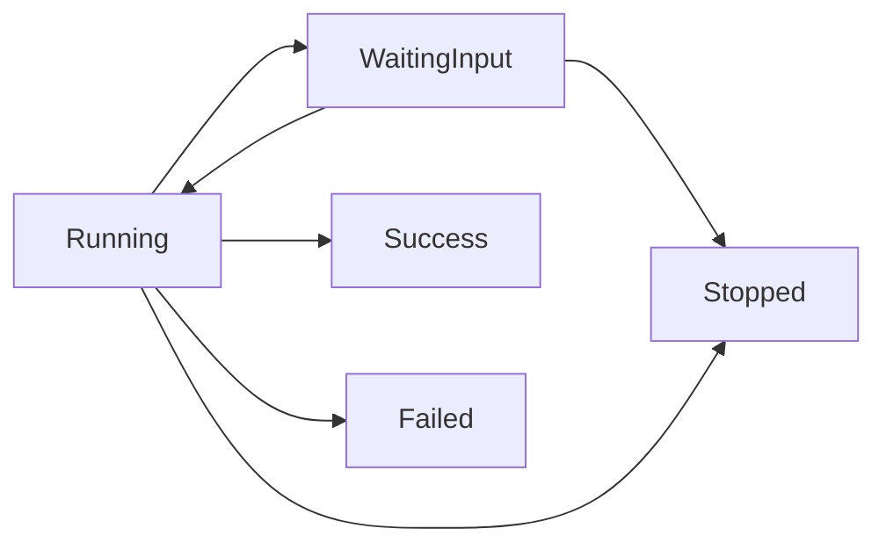
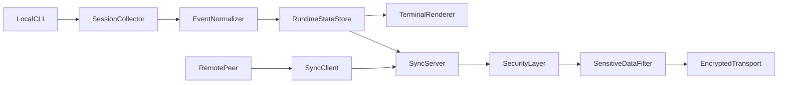

# Agent-box

Agent-box is a terminal-first monitor for AI coding agent sessions on local and remote machines.
It helps you see active Claude, Codex, and Gemini CLI sessions in one place with a consistent schema,
clear status UI, and secure peer-to-peer sync.

## Why Agent-box

- Monitor multiple agent CLIs from one terminal dashboard
- Share non-sensitive session state across trusted peers
- Keep local-first defaults and explicit network controls
- Recover gracefully from unstable networks and reconnects

## Features

### Implemented in this repository

- Local session model and renderer
- Canonical session schema and state transitions
- CLI argument parsing with safe defaults
- Remote sync primitives with authentication and redaction
- Reliability tests for parser, state, redaction, and networking behavior

### Planned

- Native adapters that auto-detect live sessions from each supported CLI
- TLS-backed transport profile for internet-facing usage
- Tailscale-first peer discovery mode
- Rich terminal themes and compact view mode

## Quick Start

### Local-only mode (recommended default)

```bash
agent-box --no-expose
```

### Listen on a custom interface and port

```bash
agent-box --ip 127.0.0.1 --port 8346 --interval 3 --protocol http
```

### Connect to a remote peer

```bash
agent-box 192.168.1.30:my_shared_key --protocol quic
```

### Behavior notes

- If IP is `localhost` or `127.0.0.1`, Agent-box only monitors local state.
- If a port is already occupied, Agent-box attempts to stop only a stale Agent-box-owned endpoint.
- If ownership cannot be confirmed, startup fails with a deterministic error message.

## CLI Reference

### Address argument

- Positional: `[IP_OR_HOST:AUTH_KEY]`
- Example: `agent-box 10.0.0.12:team_key_1`

### Flags

- `--no-expose`: local use only; do not open a network listener.
- `--ip`, `-i`: bind address, default `127.0.0.1`.
- `--port`, `-p`: bind port, default `8346`.
- `--interval`, `-t`: update interval in seconds, default `3`.
- `--protocol`, `-pr`: one of `http`, `https`, `quic`.

## Canonical Session Schema

All adapters must normalize into one schema before rendering or syncing:

```text
SessionEvent {
  id: String,                  // stable session id
  agent: AgentKind,            // claude | codex | gemini | unknown
  title: String,               // session title, truncated in UI
  working_dir: String,         // absolute or repo-relative path
  user: String,                // local username or peer alias
  status: SessionStatus,       // running | waiting_input | success | failed | stopped
  pending_action: Option<String>,
  started_at_unix_ms: u64,
  updated_at_unix_ms: u64,
  last_lines: Vec<String>      // redacted before remote sync
}
```

## Session State Transitions



Rules:
- `success`, `failed`, and `stopped` are terminal states.
- `updated_at_unix_ms` must increase monotonically.
- Unknown external states map to `running` with a warning tag.

## Terminal UI Design

Each active session is rendered as a compact colored card:

- Colored border by agent kind:
  - Claude: orange
  - Codex/OpenAI: dark/neutral
  - Gemini: blue
- Title line: white, truncated with ellipsis
- Metadata line: gray, includes working directory + user
- Status lines: gray, max two lines, redacted if needed

Status indicators:
- Pending confirmation/action: colored dot + bold action hint
- Completed successfully: flag icon + bold green `SUCCESS`
- Failure: bold red `FAILED` with latest non-sensitive reason

## Architecture



Component responsibilities:
- `SessionCollector`: source-specific adapters for local session events
- `EventNormalizer`: converts adapter payloads into canonical schema
- `RuntimeStateStore`: in-memory source of truth keyed by `SessionEvent.id`
- `TerminalRenderer`: deterministic card layout and truncation
- `SyncServer` / `SyncClient`: peer state exchange and reconnection handling
- `SecurityLayer`: auth key verification and protocol policy checks
- `SensitiveDataFilter`: censors secrets before serialization or display

## Security Model

- Default mode is local-first (`--no-expose` encouraged).
- Remote sync requires shared auth key handshake.
- Payloads are filtered to non-sensitive fields before transmission.
- Protocol policy:
  - `http`: local or private trusted networks only
  - `https` / `quic`: preferred for routed/public environments
- Rejected handshake attempts are logged with no secret echo.

## Reliability Strategy

- Retry with bounded exponential backoff for reconnect loops
- Jitter to avoid synchronized reconnect storms
- Health checks per peer connection
- Deterministic timeout and invalid-key errors

## Development Roadmap

### Phase 1: Foundation

- Finalize README spec and module boundaries
- Define schema types and transition rules
- Scaffold `src`, `docs`, and `tests`

### Phase 2: Local Monitoring MVP

- Implement parser and runtime loop
- Add collector interface and sample adapter
- Render session cards in terminal output

### Phase 3: Remote Sync + Security

- Add peer handshake and state exchange
- Add redaction pipeline and protocol guards
- Add reconnect/backoff policy

### Phase 4: Hardening and Release

- Expand integration and failure tests
- Add benchmark and load checks for update loop
- Define release checklist and semantic versioning policy

## Testing

- Unit tests:
  - CLI parsing defaults and invalid combinations
  - Schema normalization and transition validation
  - Sensitive data redaction behavior
- Integration tests:
  - Local rendering from normalized events
  - Peer sync handshake and retry outcomes
- Failure tests:
  - Port conflicts
  - Invalid auth key
  - Disconnect and reconnect handling

## Contributing

Planned contribution guide:
- Coding style and lint expectations
- Adapter interface requirements
- Security checklist for new protocol code

## License

TBD
